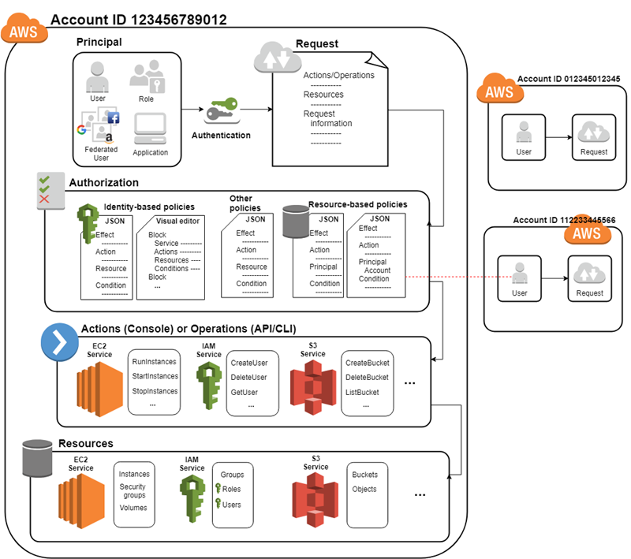

## Identity and Access Management

- IAM is used to control who is authenticated (signed in) and authorized (has permissions) to use resources.
- The default identity used to register AWS console is called as `root` user. It is recommended not to used `root` user for everyday tasks, even the administrative ones.
- The features of AWS IAM Service are given below:
  - Can create user *groups* to create and share policies based on different departments and access restrictions.
  - Can create *roles* to temporarily grant access to users or one AWS resource to another.
  - This service is free of cost, AWS IAM and AWS Security Token Service (AWS STS) are charged only when you access other AWS services using these.
  - IAM achieves high availability by replicating data across multiple servers, this results in *Eventually Consistent*.
  - IAM supports *Identity Federation*, we can use exisitng corporate SSO to login or public authentication services like facebook/Google for authentication.
  - User can also add two factor authentication using *Multi-factor authentication (MFA)*.
  - IAM provides access to AWS via
    - AWS Console
    - HTTP Rest API
    - AWS CLI
    - SDK
  
### Terms

- Building blocks of IAM operations
  - **Principal**:
    - A principal is a person or application that can make a request for an action or operation on an AWS resource.
    - This can be an IAM user, or an IAM role to sign in and make requests to AWS.
  - **Request**:
    - This is a request sent by the principal to access AWS Resource via Console/SDK/CLI/HTTP.
    - The request includes the following information
      - Action or Operation to be performed.
      - AWS Resource on which action/operation to be performed.
      - Principal requesting the action/operation.
      - Environmental data like IP address, user agent, SSL enabled status, or the time of day.
      - Resource data like DynamoDB table name or a tag on an Amazon EC2 instance.
  - **Authentication**:
    - Provide token based authentication for SDK/CLI/HTTP.
    - AWS recommends use of multi-factor authentication (MFA) to increase the security of your account.
  - **Authorization**:
    - During authorization, AWS uses values from the request context to check for policies that apply to the request.
    - Policies are JSON documents that allow or deny the request to a specific resource for a principal entity.
    - Policies are of two types `identity-based` and `Resource-based`.
    - All policies are `explicit deny`, general rules of policies are given below
      - All requests are denied. In general, requests made using the root user credentials for resources in the account are always allowed.
      - Setup user have to explicitly add allow to override this behavior.
      - The existence of an Organizations SCP, IAM permissions boundary, or a session policy overrides the allow. If one or more of these policy types exists, they must all allow the request. Otherwise, it is implicitly denied.
      - An explicit deny in any policy overrides any allows. 
  - **Actions**:
    - To allow a principal to perform an operation on a specific resource, you must include the necessary actions in a policy that applies to the principal or the affected resource. 
    - Some of the actions/operations for a user resource are given below. Actions changes based on the resource.
      - CreateUser
      - DeleteUser
      - GetUser
      - GetUser
  - **Resources**:
    - A resource is an object that exists within a service. Examples EC2 instance, an IAM user, and S3 bucket. This is also included in policy definition.

