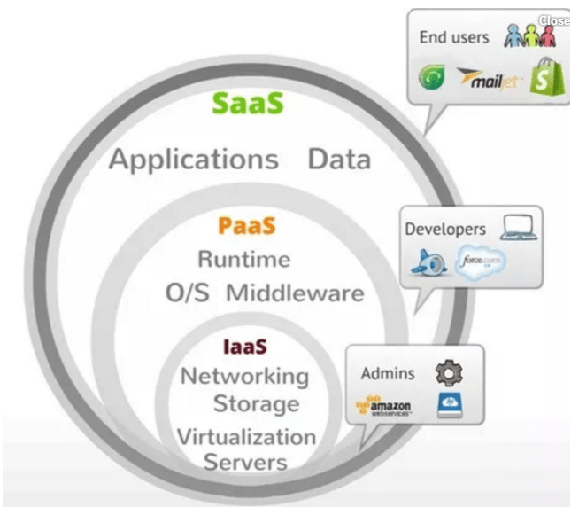
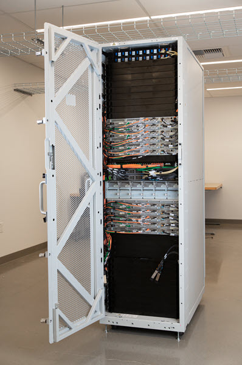

## Table of Content
- [Overview](#overview)
- [History](#history)
- [Certifications](#certifications)
- [Installation](#installation)
- [Modules](#modules)
- [Appendix](#appendix)

## Overview
- The idea of this tutorial is to provide my perspective and knowledge on **Amazon Web Service (AWS Cloud)**.
- AWS is a subsidiary of **Amazon** that provides on-demand cloud computing platforms and APIs to individuals, companies, and governments, on a metered pay-as-you-go basis.
- There three type of computer infrastructure deployment models
  - **On-Premise**: In this model, computer infrastructure is deployed and managed by individual enterprise. This approach is used where enterprise are bound to maintain the confidentially of data like banks, government agencies etc...
  - **Hybrid**: In this model, organizations will have both On-Premise and Cloud infrastructure. This model is really appreciated by lots of companies.
  - **Cloud**: This is where enterprise all operations are done are cloud. This model is used by startups where they will have the flexibility to try a new solution using cloud and scale based on the acceptance of the market.
- For any company to innovate, infrastructure is the pre-requisite. AWS helps organizations to resolve this concern. Ther are three types of cloud solutions providers
  - **IAAS**: Infrastructure As A Service, this service is used to provide enterprise requirements of Compute, Storage, Network, and Security. Offering here include EC2, S3, VPC, EBS etc...
  - **PAAS**: Platform As A Service, this service is used to provide a platform for the developer to easily deliver their solutions like Fargate, Lambda, RDS etc...
  - **SAAS**: Software As A Service, this service is an end software product used by the customer. AWS does not have any offering in this area but there are companies like Netflix, Amazon Prime, etc... provide solutions to end customers.

- AWS is trying to resolve enterprise customer's datacenter requirements like autoscaling, multi-region availability, fault-tolerant, and security. These are provided with below:
  - **Regions**: There are different areas where AWS provides datacenters like Virginia, London, etc... The exact location details of these regions are highly classified to avoid threats from terrorist attacks as this contains multiple enterprise customer's data.
  - **Availability Zones (AZ's)**: These are exact areas where data centers are available. Alphanumeric names will be used to indicate these areas like 1a, 1b. In a region, there will be atleast two availability zone. These are typically located in extreme opposite locations in a region to avoid environmental catastrophes. A completed list of AWS AZ's are listed [here](https://aws.amazon.com/about-aws/global-infrastructure/).
  - **Edge Locations**: A site that CloudFront uses to cache copies of your content for faster delivery to users at any location. A completed list of AWS Edge Locations are listed [here](https://aws.amazon.com/cloudfront/features/). These are owned and managed by AWS or AWS Partners. These are directly connected to AWS datacenters.
  - **Global Network**: Every data center, AZ, and AWS Region is interconnected via private global network infrastructure managed by AWS. Connectivity details are available [here](https://aws.amazon.com/about-aws/global-infrastructure/global_network/)
  - **Data Transfer**:
    - **Snowball**: It is a petabyte-scale data transport solution that uses devices designed to be secure to transfer large amounts of data into and out of the AWS Cloud.
    - **Snowball Edge**: It is a data migration and edge computing device that comes in two options 24 vCPUs and 52 vCPUs and an optional GPU. This is used for processing and transfer of data. 
    - **Snowmobile**: It is an Exabyte-scale data transfer service used to move extremely large amounts of data to AWS. You can transfer up to 100PB per Snowmobile, a 45-foot long ruggedized shipping container, pulled by a semi-trailer truck. 
    - **Direct Connect**: It is a dedicated physical connection to accelerate network transfers between customer datacenters to AWS.
    - **DataSync**: It helps to migrate active data sets or archives to AWS S3, EFS or FSx. Customer will pay only for the data movement.
  - **Datacenter**
    - AWS also provide a modular datacenter called **Perdix** container.
    
    - AWS also provide a **Outposts**, single-vendor compute & storage solution that is fully managed by AWS in customer datacenter. This is the same hardware used by AWS for there internal datacenters.
    
    - Aws provide **Nitro Cards** that are powers EC2 instances with an ever-broadening selection of compute, storage, memory, and networking.

---
## History
- AWS started in **2002** by providing SOAP and XML interfaces for the Amazon product catalog.
- In **2003**, during an executive retreat at Jeff Bezos’ house, the Amazon leadership team was asked to identify the core strengths of the company. Its infrastructure was identified as a huge advantage over their competition.
- The company decided to provide a combination of infrastructure services and developer tools as an actual product for developers over the internet. They started to think of this set of services as a sort of operating system for the internet. 
- In late **2003**, the AWS concept was publicly reformulated when **Chris Pinkham** and **Benjamin Black** presented a paper describing a vision for **Amazon's retail computing infrastructure**.
- In **2004**, the company’s first public acknowledgment AWS in a [blog post](https://aws.amazon.com/blogs/aws/welcome/).
- In **November 2004**, the first AWS service launched for public usage, **Simple Queue Service (SQS)**. Thereafter **Pinkham** and lead developer **Christopher Brown** developed the **Amazon EC2** service, with a team in **Cape Town, South Africa.**
- AWS was officially re-launched on **March 14, 2006**, with three services S3, SQS and EC2. **Andy Jassy** was AWS founder and Vice President in 2006. In 2016, Jassy was promoted to CEO of the division.
- Milestones
  - In November 2010, Amazon.com's retail sites had migrated to AWS.
  - In November 2012, AWS hosted its first customer event in Las Vegas.
  - In 2014, AWS launched its partner network entitled APN (AWS Partner Network).
  - In January 2015, Amazon Web Services acquired Annapurna Labs, an Israel-based microelectronics company.
  - In January 2018, Amazon launched an autoscaling service on AWS.
  - In November 2018, AWS announced customized ARM cores and ground stations to communicate with customer's satellites.
  - [Timeline](https://en.wikipedia.org/wiki/Timeline_of_Amazon_Web_Services)
- [Outages](https://en.wikipedia.org/wiki/Timeline_of_Amazon_Web_Services)

---
## Certifications
- AWS Certification validates cloud expertise to help professionals highlight in-demand skills and organizations build effective, innovative teams for cloud initiatives using AWS.
- Below are the different [certifications](https://aws.amazon.com/certification/) provided by AWS. This tutorial focus on fundaments for **AWS Associate Developer**. 
  - Foundation is optional for Associate.
  - Associate is mandatory for Professional program.
  - Atleast one Foundation/Associate program required for Specialization Program.
   

---
## Installation
- AWS Support accessing management console using below. This tutorial focus on using AWS Console. A brief overview of other access mechanisms is detailed in the Identity module below. 
  - [AWS UI Console](https://console.aws.amazon.com) 
  - AWS CLI
  - AWS Rest API

---
## Modules
- There are multiple modules of AWS that we have to go through to master it. Below is a comprehensive list of modules that will be covered as part of this tutorial.
  - [IAM](./02-Modules/01-iam.md)
  - VPC
  - Cloud Watch
  - Storage
  - EC2
  - Cloud Front
  - Cognito
  - RDS
  - Batch
  - Kinesis
  - Kendra
  - EKS
  - Lamda
  - API Gateway
  - Elastic Bean
  - Fargate
  - Lex
  - Alexa
  - Sage Maker
  - Ops Works

---
## Appendix
- Reference
  - [LinuxAcademy](https://linuxacademy.com/learning-path/amazon-web-services-master-level/)
  - [Greatlearning](https://www.greatlearning.in/academy/enterprise/courses/cloud-computing-with-aws)
  - [FreeCodeCamp](https://www.youtube.com/watch?v=3hLmDS179YE&t=4391s)
  - [Datacenterknowledge](https://www.datacenterknowledge.com/archives/2011/06/09/a-look-inside-amazons-data-centers)
  - [AWS reInvent Nitro 2018](https://www.youtube.com/watch?v=e8DVmwj3OEs&t=3342s)
  - [AWS reInvent Nitro 2019](https://www.youtube.com/watch?v=rUY-00yFlE4)
    